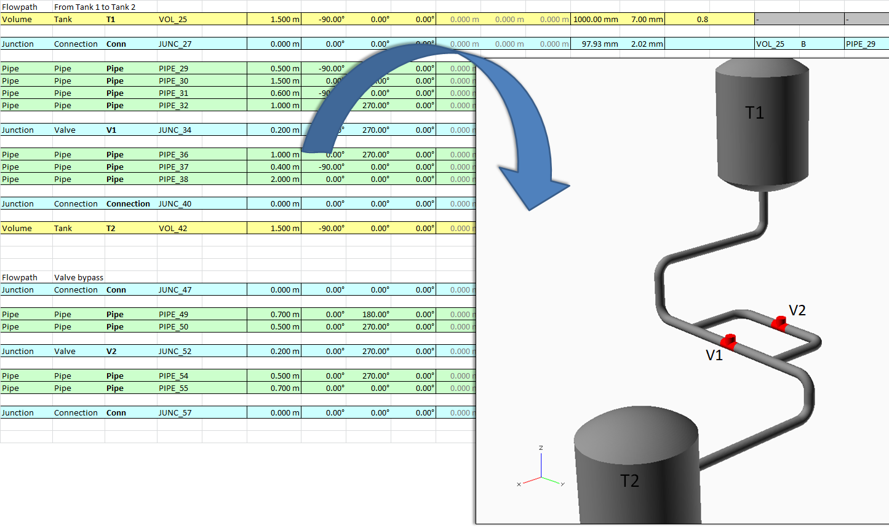

# The Basics
XlsPipePlot is a program that generates a OpenSCAD input file to illustrate a pipe system using simple input. The input is best generated using a Excel (or other) spreadsheet. This input is then fed into the main program that generates the OpenSCAD output file.

`>XlsPipePlot.exe -input MyPipeSystem.txt -output MyPipeSystem.scad`

## Component and Segments
A *component* consists of one or many *segments*.

## Component/segment type
The second word of the input describes what type the segment (or component) is. There is not limit how many components that can be created (see XX Creating custom types).

## Junction, Pipe and Volume family
The family doesn't carry that much weight. Mostly it is a easy way to trigger a conditional formatting in the spreadsheet.

## Connections
The actual position of the components depends on how they are connected. It's best illustrated with an example.

## Template files
Template files are OpenSCAD input files (.scad) with keywords instead of values. These keywords are later replaced with the actual values.

## Input sheet
A crucial part to be able to build intricate models is a good way
